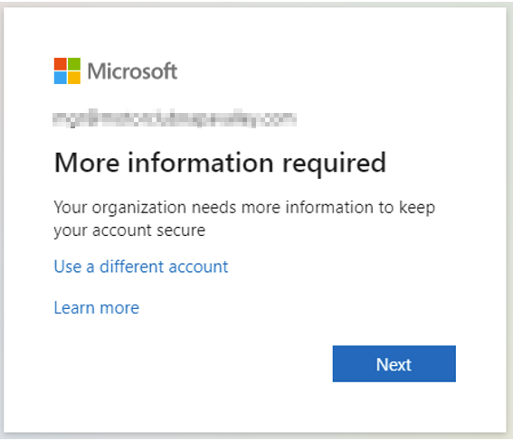
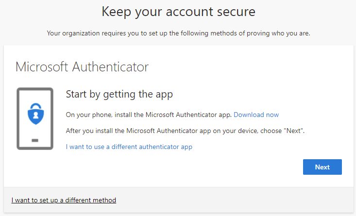
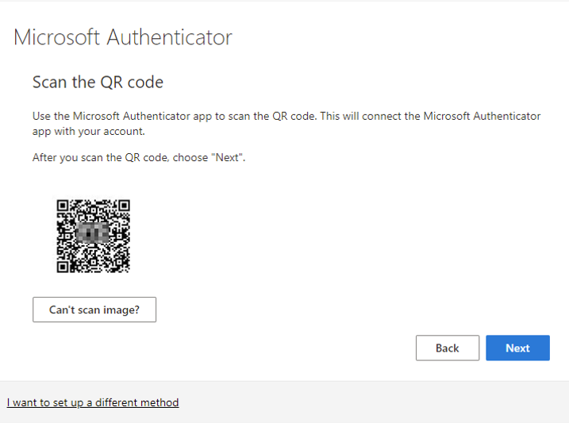
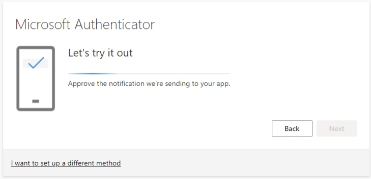
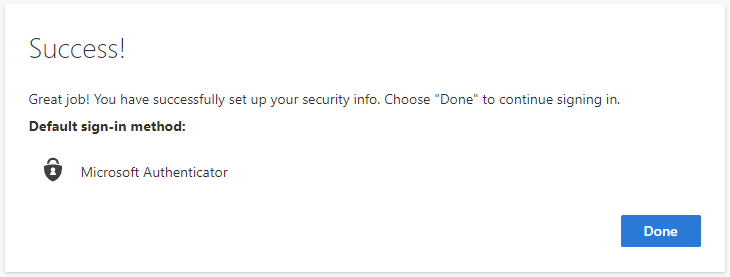

# User Guide to Enable Multi-Factor Authentication (MFA) in Microsoft 365

## :mobile\_phone: **Install the** [**Microsoft Authenticator App**](https://www.microsoft.com/en-us/security/mobile-authenticator-app) **on your mobile device**

* Open this document from your mobile device.
* Follow the appropriate link below based on your device platform (iPhone or Android). Make sure only to install the official Microsoft Authenticator App.
* iPhone - [Microsoft Authenticator on the App Store (apple.com)](https://apps.apple.com/us/app/microsoft-authenticator/id983156458)
* Android - [Microsoft Authenticator - Apps on Google Play](https://play.google.com/store/apps/details?id=com.azure.authenticator\&hl=en_US\&gl=US)

## :closed\_lock\_with\_key: **Activate MFA**

1. Open this document on your primary work computer.
2. Follow this link and sign in using your new email account credentials: [http://aka.ms/mfasetup](https://aka.ms/mfasetup)
3. Follow the instructions on the screen to confirm your email account and password (see screenshots below for examples).
4. When prompted, **open the Microsoft Authenticator app on your mobile device**, and click the + icon to add a new account.
5. Choose “**Work or School**”
6. Position the QR code on the screen within the boxes of the camera view.
   * Depending on your phone model, you may need to allow access to the camera.
7. Continue through the prompts to test sign-in from your mobile device.
8. MFA is now configured for your primary work email account.  Great work :clap:

## :vertical\_traffic\_light: **In the future, you'll occasionally be prompted to confirm sign-ins with MFA.**

* This may happen from Outlook or other Office applications, from apps on your mobile device, or when accessing the Office 365 webmail interface.
* By default, the confirmation should be a push notification. A prompt on-screen will ask you to confirm sign-in. You should receive a notification on your mobile device asking to “**Approve**” or “**Deny**” sign in.
  * Choose “**Approve**” if you are receiving a prompt for one of the scenarios listed above.
  * Choose “**Deny**” if you are not aware of any legitimate sign-ins. &#x20;

&#x20;**Example Screenshots:** \

---------------------------------

.png>)

.png>)

.png>)

