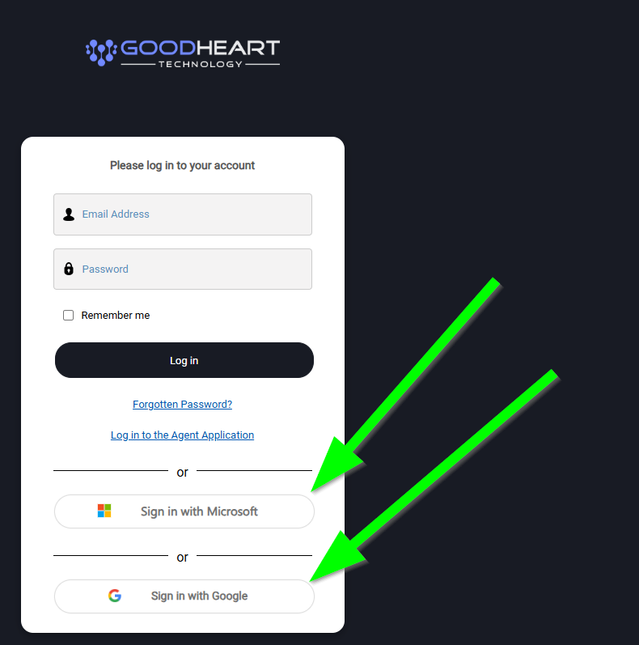

# 🧑‍💻 Accessing Good Heart Tech's Support Portal

Use our support portal to submit tickets, review updates, and view your IT inventory and reports.

👉 [https://support.goodhearttech.org](https://support.goodhearttech.org/)

### Sign in

Log in with your organization's **Google** _or_ **Microsoft 365** account. No separate password required.

<figure><figcaption></figcaption></figure>

### What you can do in the portal

Inside the portal, you can:

* Submit new support tickets
* Review and update existing tickets
* See lists of your PCs and users
* View metrics and reports on past services we’ve provided, including the total number of volunteer hours.&#x20;

### Need help logging in?

Email us at [support@goodhearttech.org](mailto:support@goodhearttech.org).
