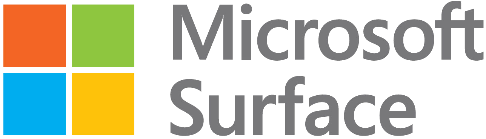

# 💻 Computers & Servers

For nonprofits, procuring computers and other tech equipment can be challenging on a budget. Below, we outline some great resources for finding low-cost or free computers.


We only recommend purchasing Windows 11 computers. [Windows 10 became obsolete in October 2025](https://www.microsoft.com/en-us/windows/end-of-support?r=1).


## Computer minimum requirements (recommended)

We recommend only buying PCs that meet these minimum specs:

* **Windows 11**, not Windows 10. [Windows 10 became obsolete in October 2025](https://www.microsoft.com/en-us/windows/end-of-support?r=1).
* **RAM:** 16 GB minimum
* **Storage:** 512 GB **SSD** minimum
* **Display**: Has a screen that's at least 1080p (1920 x 1080 pixels, AKA Full HD)
* **Windows edition:** **Windows 11 Pro** (not Home)
  * Home cannot join Microsoft Entra ID (Azure AD) or an Active Directory domain.
  * Home often ships with extra consumer apps (“bloatware”).
  * If you must buy Windows 10, get **Windows 10 Pro** (not Home).

## Computer Sources

Here are some of the places you may consider looking for PCs for your nonprofit:

| Organization                                                                  | Offers                         | Elibility Requirements                                                                                                                                                            | Cost                |
| ----------------------------------------------------------------------------- | ------------------------------ | --------------------------------------------------------------------------------------------------------------------------------------------------------------------------------- | ------------------- |
| [TechSoup](https://www.techsoup.org/search/products/dell/)                    | Refurbished Dell, HP, & Levono | Nonprofit [application process](https://www.techsoup.org/joining-techsoup/how-to-join-techsoup)                                                                                   | Low                 |
| [Dell Refurbished](https://www.dellrefurbished.com/)                          | Refurbished Dell               | N/A                                                                                                                                                                               | Low                 |
| [Deals.dell.com](https://www.dell.com/en-us/shop/deals)                       | New & Refurbished **De**ll     | N/A                                                                                                                                                                               | Low                 |
| [Electronic Recycling Association](https://www.era.ca/apply-for-donations/)   | Refurbished                    | Only Nonprofits in Canada and US States: California, Illinois, Massachusetts, New York, Texas, Vermont                                                                            | Free                |
| [Computers with Causes](https://www.computerswithcauses.org/application/)     | Refurbished                    | Nonprofits apply via snail [mail PDF here.](https://www.computerswithcauses.org/application/)                                                                                     | Free                |
| **Human-I-T**                                                                 | Refurbished                    | Nonprofits [apply here](https://store.human-i-t.org/nonprofit-membership/).                                                                                                       | Low                 |
| [Connect All](https://connectall.org/collections/laptop)                      | Refurbished                    | <ul><li>Order on website for less than 5 devices.</li><li>Email <a href="mailto:programs@interconnection.org">programs@interconnection.org</a> for more than 5 devices.</li></ul> | Very Low ($50-$150) |
| [Your Local PC Recycler](https://www.google.com/search?q=pc+recycler+near+me) | Refurbished                    | Variable                                                                                                                                                                          | Very Low / Free     |

## PC Hardware

#### Dell

<figure><figcaption></figcaption></figure>

[Deals.dell.com](https://www.dell.com/en-us/shop/deals) or the [Dell Catalog on TechSoup ](https://www.techsoup.org/search/products/dell/)provides reliable hardware, fast performance, and a great price point. Most times, we recommend:

* **Desktops**: [OptiPlex](https://www.dell.com/en-us/shop/scc/sr/desktops/optiplex-desktops) or [XPS](https://www.dell.com/en-us/shop/desktop-computers/sr/desktops/xps-desktops) models.
* **Laptops**: [Latitude](https://www.dell.com/en-us/shop/dell-laptops/sr/laptops/latitude-laptops) or [XPS](https://www.dell.com/en-us/shop/dell-laptops/sr/laptops/xps-laptops) models

#### HP

HP has great PCs available:

* HP Laptops - [16 GB 512 GB Business | HP® Store](https://www.hp.com/us-en/shop/vwa/business-solutions/bizcat=Laptop\&mem=16-GB\&ssd=Yes\&stor=512-GB)
* HP Desktops - [16 GB 512 GB Desktops | HP® Store](https://www.hp.com/us-en/shop/vwa/desktops/mem=16-GB\&ssd=Yes\&stor=512-GB)

#### Microsoft Surface

<figure><figcaption></figcaption></figure>

[Microsoft Surface](https://www.microsoft.com/en-us/surface) is a line of portable and versatile computers, and [TechSoup typically has good deals.](https://www.techsoup.org/hardware?cg=pc)

## Servers 

We recommend avoiding physical servers wherever possible because of the affordability and stability of [nonprofit cloud hosting options](computers-and-servers.md#hosting-providers4). However, if on-premise infrastructure is required, we recommend [Dell PowerEdge](https://www.dell.com/en-us/dt/servers/index.htm) servers.
