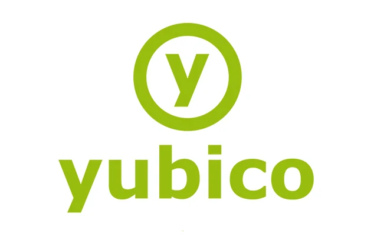

# 🔑 MFA/Security Token

## Yubico YubiKeys

<figure><figcaption></figcaption></figure>

[Yubico's Secure It Forward program](https://www.yubico.com/why-yubico/secure-it-forward/) combats online threats for nonprofits by **donating YubiKeys**, which add a powerful layer of security called Multi-Factor Authentication (MFA). Regular passwords are easily stolen, but YubiKeys require a physical touch to log in, stopping hackers in their tracks. Strong MFA is essential for nonprofits, but can be expensive. Secure It Forward makes it easy for them to enable robust authentication **by providing free YubiKeys.** These YubiKeys work seamlessly with Google Workspace and Microsoft 365, and many other cloud services. By taking advantage of this program, nonprofits can empower their staff and users with a significant security boost, allowing them to focus on their mission without compromising online safety. [Apply here. ](https://www.yubico.com/why-yubico/secure-it-forward/#secure-it-forward)

## Need Help Setting Up A YubiKey?


[setting-up-a-yubikey-hardware-mfa-token-with-microsoft-365.md](../../microsoft/microsoft-365-user-guides/setting-up-a-yubikey-hardware-mfa-token-with-microsoft-365.md)



[setting-up-a-yubikey-hardware-mfa-token-with-google-workspace.md](../../google-workspace/google-workspace-nonprofit-user-guides/setting-up-a-yubikey-hardware-mfa-token-with-google-workspace.md)


