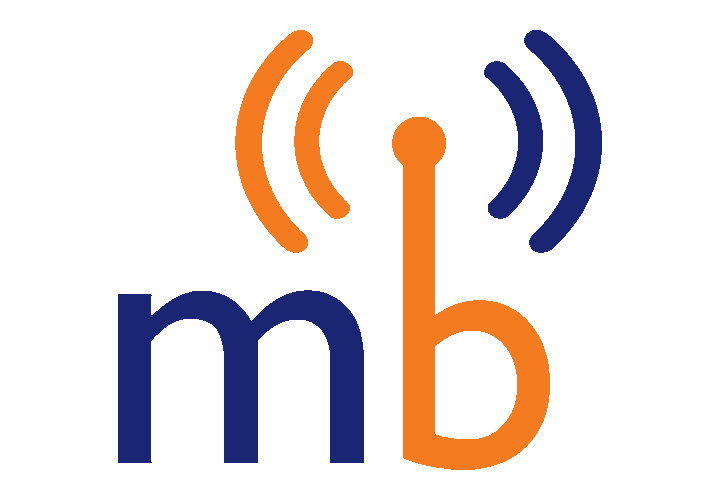

# 📡 Networking & Wi-Fi

Enhance your nonprofit's connectivity with these networking and hardware recommendations. Whether deploying a new network or refining existing setups, our selections are geared for optimal performance and affordability.

### Mobile Hotspots

<figure><figcaption></figcaption></figure>

The [Mobile Beacon hotspots available on TechSoup](https://www.techsoup.org/mobile-beacon) make it easy to ensure you have internet connectivity anywhere. The pricing is simple: $30 up-front admin fee and $120/year. After purchasing through TechSoup, you'll receive an activation email, which you'll need to follow to complete the purchase activation of the service. When you receive the device, [we recommend you log in to the device and change the wireless network name and password](https://www.mobilebeacon.org/wp-content/uploads/2020/08/SPRINT_LINKZONE2_UM.pdf).

### Wireless Access Points & Switches 

#### HP Aruba Instant On

<figure><figcaption></figcaption></figure>

The[ Aruba Instant On](https://www.arubainstanton.com/) products provide free cloud management with the device's purchase. These devices are straightforward to set up and manage.&#x20;

* Wireless access points provide incredible wireless network security, visibility, and range. We recommend the [AP22](https://www.arubainstanton.com/products/access-points/access-point-22/) or [AP25](https://www.arubainstanton.com/products/access-points/access-point-25/) for all indoor uses.&#x20;
* All network switches in the Aruba Instant On [1930](https://www.arubainstanton.com/products/switches/1930-series/) or [1960 lines](https://www.arubainstanton.com/products/switches/1960-series/) are great, modern ways to power the backbone of your network.&#x20;

### Cabling 

Cat6 and Cat5e Ethernet standards are best for almost all cases, including connecting computers and network devices to the network. Cat7 and Cat8 will work but are typically more expensive for the same speed.&#x20;

* [Amazon.com: 20-Pack Cat6 Patch Cable](https://www.amazon.com/dp/B07MVRL1FH/?th=1)

