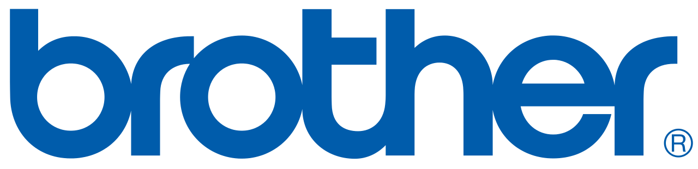

# Printers & Scanners


**If you only pick one:** A Brother black-and-white laser (such as the HLL2395DW). Use a print shop when you occasionally need color.


## General Recommendations

We recommend modern printers and scanners that allow for secure imaging to cloud services. For example, the model below can scan directly to cloud services like OneDrive, Google Drive, SharePoint, and any email address.

## Brother

We recommend **Brother printers** because they’re reliable, cost-effective, and capable of handling most printing and scanning needs with ease.

* **Black & White:** [Brother HLL2395DW](https://www.amazon.com/gp/product/B0764NWFP8) - A dependable, cost-effective choice. Ink refills are available here.
* **Color:** [Brother MFC-L3720CDW](https://www.amazon.com/Brother-Color-Printer-Scanner-Copier/dp/B0CFCZWPFD/?th=1)  - A solid option for regular color printing, though color ink is pricier.


If you rarely print in color, stick with black and white and use a service like FedEx Office when color is needed. It’s more economical and avoids common issues with color printers.


## Scan to Email

When configuring scanning to email, it's important to consider security.  Always configure scanning according to the email provider's specifications, and use the highest recommended option. &#x20;

We highly recommend that [SMTP2Go](https://www.smtp2go.com/) be set up as an email relay and verified with DNS/DKIM for security and ease of use.&#x20;

<table data-view="cards"><thead><tr><th></th><th></th><th></th><th data-hidden data-card-target data-type="content-ref"></th></tr></thead><tbody><tr><td></td><td>Microsoft 365 Scan to Email Setup</td><td></td><td><a href="https://learn.microsoft.com/en-us/exchange/mail-flow-best-practices/how-to-set-up-a-multifunction-device-or-application-to-send-email-using-microsoft-365-or-office-365">https://learn.microsoft.com/en-us/exchange/mail-flow-best-practices/how-to-set-up-a-multifunction-device-or-application-to-send-email-using-microsoft-365-or-office-365</a></td></tr><tr><td></td><td>Google Workspace Scan to Email Setup</td><td></td><td><a href="https://support.google.com/a/answer/176600?hl=en">https://support.google.com/a/answer/176600?hl=en</a></td></tr></tbody></table>

*Last reviewed: 2026-08.*
