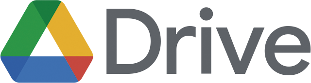
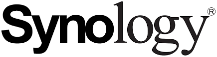

# ⬆️ Backup Software for Nonprofits

Backup software ensures data security and continuity by regularly backing up critical information. This technology minimizes the risk of data loss, providing nonprofits with a reliable safeguard against potential disruptions and fostering operational resilience.

### **Microsoft OneDrive** 

<figure><figcaption></figcaption></figure>

[Microsoft OneDrive](https://www.microsoft.com/en-us/microsoft-365/onedrive/online-cloud-storage) is included in the free Microsoft licenses nonprofits receive, and the application [can be downloaded here](https://www.microsoft.com/en-us/microsoft-365/onedrive/download). In addition, giving easy access to your organization's SharePoint document libraries, OneDrive can be easily configured to back up your critical documents to the cloud. Files synced to the cloud are available across all your devices and are backed up automatically. OneDrive backup is **not technically a full backup solution**. Sync issues can cause data loss. For more advanced backup features and a full BCDR solution, see Veeam or Synology below.

### **Google Drive**

<figure><figcaption></figcaption></figure>

[Google Drive](https://workspace.google.com/products/drive/) is a popular option for nonprofits leveraging Google Workspace. The Google Drive Desktop app allows users to sync cloud data directly to their devices, making files accessible offline and ensuring they're continuously synced. However, like OneDrive, Google Drive is **not a true backup solution**. Syncing is not the same as backing up, as accidental deletions or changes in the cloud will propagate to synced devices. For nonprofits needing a more reliable and feature-rich BCDR solution, consider options like Synology Active Backup or Veeam.

### CubeBackup

[CubeBackup](https://www.cubebackup.com/) backs up **Google Workspace** and **Microsoft 365**. Licensing is per **active backup user**.You can choose to license only the users you back up. Pricing: [https://www.cubebackup.com/en/pricing](https://www.cubebackup.com/en/pricing)

* Google Workspace: **$5/user/year** (Business/Enterprise), **$2/user/year** (Education/Non-profit)
* Microsoft 365: **$5/user/year** (Business/Enterprise), **$2/user/year** (Education/Non-profit)


Backups for Shared drives, Teams, & SharePoint are free with an active user license.&#x20;


### Veeam 

<figure><figcaption></figcaption></figure>

[Veeam](https://www.veeam.com/) is a full-featured suite of backup solutions. With Veeam Backup & Replication, you can do simple things like schedule backups for your PC and even back up virtual machines. The [free community edition of Veeam Backup & Replication](https://www.veeam.com/virtual-machine-backup-solution-free-download.html) is incredibly feature-packed but requires significant technical experience to configure, which is not advised for light computer users. With other components of the Veeam Suite, you can do more complex things like a backup of [Microsoft 365 (free for 10 users)](https://www.veeam.com/backup-microsoft-office-365.html).

### Synology

<figure><figcaption></figcaption></figure>

[Synology Active Backup](https://www.synology.com/en-global/dsm/feature/active-backup-business/pc) is a robust BCDR solution for nonprofits, enabling seamless backup of Google Workspace, Microsoft 365, and/or on-premises data. Included with the purchase of a Synology NAS, it protects against data loss from deletion, ransomware, or outages. When purchasing a Synology device, ensure it supports Active Backup and provides adequate storage for long-term needs. This centralized solution simplifies management, offers efficient recovery, and enhances data resilience for mission-critical operations.
