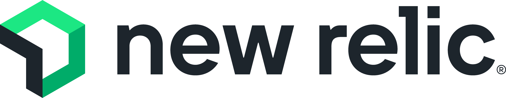

# ⌨️ Coding & Software Development

Coding and software development can be invaluable for nonprofits seeking custom solutions tailored to their specific operational needs, improving efficiency and functionality. However, not all nonprofits may require these capabilities, as some can effectively leverage existing technologies without the need for extensive coding, directing their resources toward other mission-critical areas.

### GitHub

<figure><figcaption></figcaption></figure>

[GitHub](https://github.com/) is the most popular source code management platform in the world. Microsoft owns this product, and they offer a [free version for nonprofits](https://socialimpact.github.com/). Most nonprofits don't need this tool, but it can be beneficial if you deal with programming or code. Free nonprofit setup steps:

1. Create a free personal account and verify it using your nonprofit email address.
2. In Settings, create a new organization.&#x20;
3. Go to [the nonprofit application page](https://support.github.com/contact/nonprofit) and upload your nonprofit information to complete the application. Wait a few days to get approved.&#x20;

### New Relic

<figure><figcaption></figcaption></figure>

[New Relic ](https://newrelic.com/)is a performance monitoring platform that helps optimize applications and infrastructure. It provides insights into response times, server health, and user satisfaction. [For nonprofits, New Relic offers the platform for free](https://newrelic.com/social-impact/signup), making it a valuable tool for network visibility and optimization.  We only recommend this tool for larger nonprofits or organizations with a larger technological footprint.&#x20;

### Sentry

<figure><figcaption></figcaption></figure>

Sentry is an open-source error tracking and performance monitoring platform that helps developers quickly diagnose, fix, and optimize their applications. It supports a wide range of languages, frameworks, and environments, making it a powerful tool for maintaining application health and user experience.

Sentry offers **free accounts for qualifying nonprofit organizations**, allowing them to use its robust error monitoring and performance insights at no cost.

**To apply for a free nonprofit account:**

1. **Create a Sentry account** here: [https://sentry.io/signup/](https://sentry.io/signup/)
2. **Submit a sponsorship application** here: [https://sentry.io/sponsorship](https://sentry.io/sponsorship)

