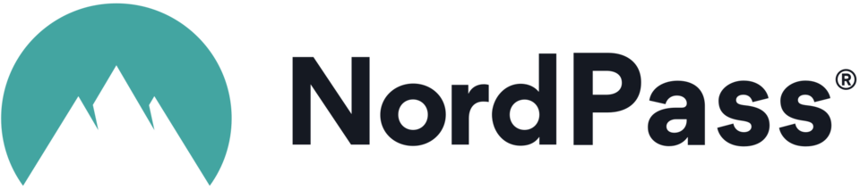

# 🔑 Password & Documentation Platforms for Nonprofits

Password and documentation platforms provide nonprofits with a secure infrastructure for managing sensitive information, mitigating the risk of data breaches, and ensuring compliance with industry standards. These platforms enhance operational efficiency by centralizing access control, streamlining documentation processes, and promoting secure password management practices, contributing to nonprofit organizations' overall resilience and data integrity.

You should never use passwords in conventional Excel, Word, or Google Docs documents. Instead, use robust encryption mechanisms and dedicated password management systems to safeguard sensitive credentials, ensuring higher security and data protection.


Interested in FREE hardware MFA tokens for your nonprofit?  Check out: [mfa-security-token.md](../hardware/mfa-security-token.md "mention")


## Password Management 

### **NordPass**

<figure><figcaption></figcaption></figure>

[**NordPass**](https://nordpass.com/nonprofit-password-manager/) is a secure and easy-to-manage password management platform that offers **up to 35% off for nonprofits**. Developed by the same team behind NordVPN, NordPass supports **password sharing**, **password health auditing**, **data breach monitoring**, and **SSO/SAML integration** for enterprise-level identity management. NordPass also provides **cross-platform sync** across web, desktop, and mobile apps, making it an excellent fit for distributed nonprofit teams looking to manage credentials efficiently and securely.

### 1Password 

[1Password Teams](https://1password.com/teams) is a robust business-grade password management system with an unadvertised nonprofit rate (50% off the normal [teams rate](https://1password.com/business-pricing)).  Email [business@1password.com](mailto:business@1password.com) to learn more and receive the discount.

### DashLane 

[**DashLane Business**](https://www.dashlane.com/pricing) is a fantastic choice for nonprofits seeking a robust password manager. Its user-friendly interface and advanced security features make it easy to protect sensitive data. By utilizing [TechSoup's 50% discount ($admin fee of $35),](https://www.techsoup.org/products/dashlane-business-g-52246-) nonprofits can acquire DashLane at a significantly reduced cost ($4 per user per month), making it an affordable option.&#x20;

### Psono

[Psono](https://psono.com/pricing) offers a secure and flexible password management solution ideal for nonprofits. Organizations can benefit from a 50% discount on standard pricing. Psono's free offerings are particularly generous, providing robust features without the need for an immediate upgrade. For detailed information on what the free plan includes, visit their [pricing page](https://psono.com/pricing). To get started with nonprofit discounts, email Psono support at [support@psono.com](mailto:support@psono.com).&#x20;

## Password & IT Documentation Tools

### Hudu

<figure><figcaption></figcaption></figure>

[Hudu ](https://www.hudu.com/)is an incredible platform for managing passwords and documentation for your organization. It's very customizable and can mold to your needs. Hudu offers some special nonprofit pricing, but you'll have to[ reach out to inquire](mailto:contact@usehudu.com) about your specific organization.&#x20;

## **Documentation Tools**

### **GitBook**

<figure><figcaption></figcaption></figure>

[GitBook ](https://gitbook.com)is a versatile knowledge-sharing platform. It streamlines information management, aiding collaboration.  In fact, this website is built on Gitbook! To access [the **free** nonprofit offering](https://docs.gitbook.com/account-management/plans/apply-for-the-non-profit-open-source-plan), visit GitBook's site, provide details, and verify your nonprofit status. [Full instructions here](https://docs.gitbook.com/account-management/plans/apply-for-the-non-profit-open-source-plan#how-to-apply).

