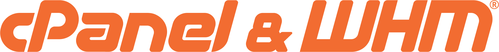

# 🌐 Website & DNS Services for Nonprofits

Website and DNS services, including hosting and components, are vital for nonprofits, offering a digital presence and reliable infrastructure. These tools facilitate easy website management, ensure seamless hosting, and provide essential features for online visibility.

## Domain Registrar & DNS Hosting 

#### **Cloudflare** 

<figure><figcaption></figcaption></figure>

[Cloudflare](https://cloudflare.com/) is a free **DNS host** and offers the lowest prices on the internet for [**domain registration services**](https://www.cloudflare.com/products/registrar/). It's one of the best fits for most nonprofits because it keeps costs low, speeds up websites, and adds strong security without much ongoing work. You can use it as your free **DNS host**, buy domains at near-wholesale pricing through [this page](https://www.cloudflare.com/products/registrar/), and manage everything in one place.

**Why nonprofits like it**

* Free core tools that cover what most small nonprofits need.
* Very reliable DNS, so your website and email records stay stable.
* Built-in performance and security features with little setup.
* Simple to scale later if your website or security needs grow.

**Free tier highlights**

* Free DNS hosting, with a fast global CDN to speed up websites
* Free SSL support for website encryption
* DDoS protection for basic attack protection
* Caching and performance tools
* Page Rules and redirects for simple traffic control
* Basic analytics and traffic insights
* Access to Cloudflare Pages for static websites

For most nonprofits, Cloudflare is the easiest way to get affordable DNS, better website speed, and stronger protection in one place.


[transfer-an-existing-domain-name-to-cloudflare.md](../../tech-guides/domain-and-dns/transfer-an-existing-domain-name-to-cloudflare.md)


## Website Hosting & Builders 

All these services provide **website hosting for nonprofits**, and some vendors can host much more than just a website. Some services offer discounts to nonprofits, while others give no discounts.


Choosing the best website builder or hosting platform varies drastically based on your organization's needs. We typically recommend selecting the platform that your content creators will be most comfortable with, which will help ensure the content stays up-to-date and the website remains user-friendly.


### All-in-one Website Builders

* [Wix](https://wix.com/) provides a simple website management platform that's easy to use. Wix offers a discounted rate for nonprofits ($35 per year), which can be purchased from [TechSoup](https://www.techsoup.org/search/products/wix/). If Cloudflare services like Zero Trust are used, caution should be used when deploying a Wix website to avoid accidentally moving nameservers to Wix.
* [Google Sites](https://sites.google.com/) is a free and easy-to-use platform for building simple websites. This option is especially popular with nonprofits needing a simple site without too many features or just starting and needing a landing page.
* [Squarespace'](https://www.squarespace.com/)s user-friendly editing interface makes it easy for nonprofits to build and update their website without needing coding knowledge. However, Squarespace doesn't offer specific discounts for nonprofits besides a [general first-year discount](https://www.squarespace.com/coupons), and their features might be limited for complex websites.

### Website Hosting Providers


Good Heart Tech's nonprofit partners receive free WordPress website hosting, training, and [website maintenance](https://goodhearttech.org/website-maintenance/)[ plan.](https://goodhearttech.org/website-maintenance/)


#### Static Content Website Builders

These services allow you to quickly create and host static websites. They are ideal for showcasing information like blogs, portfolios, or simple landing pages without requiring a backend server or advanced technical knowledge.

* [**Cloudflare Pages**](https://developers.cloudflare.com/pages/) – Free static site hosting service with global content delivery through Cloudflare's network. Integrates seamlessly with Git repositories.
* [**GitHub Pages**](https://docs.github.com/en/pages) – Free hosting for static sites directly from your GitHub repository. Great for developers and projects with open-source components.

#### Server-Based Web Hosting

These services allow you to host static content or server-based applications and websites. They offer more flexibility than static site builders but often require more technical expertise to set up and manage.


All of the services below must be manually renewed yearly or when the granted credits run ou&#x74;_._


* [Amazon Web Services (AWS) LightSail](https://aws.amazon.com/lightsail/) – For just $95, purchase a $1000 annual [AWS grant from TechSoup.](https://www.techsoup.org/products/amazon-web-services-credits-for-nonprofits-g-50197-) We only recommend this option for technical folks, as[ it gets pretty involved](https://aws.amazon.com/getting-started/hands-on/launch-a-wordpress-website/). The AWS annual renewable grant can be used for almost any AWS service.
* [Microsoft Azure](https://azure.microsoft.com/) – Review [the instructions](https://learn.goodhearttech.org/microsoft-365/microsoft-365-setup-for-nonprofits/how-to-claim-usd2000-in-annual-azure-credits-for-your-nonprofit) to apply for a[ $2000 annual Azure grant.](https://docs.microsoft.com/en-us/azure/industry/training-services/microsoft-community-training/infrastructure-management/install-your-platform-instance/setup-platform-instance-on-azure-subscription-for-nonprofits)
* [Oracle Cloud Free Tier](https://www.oracle.com/cloud/free/) – Oracle offers "Always Free" cloud resources, including server options that may be enough to run a small application or website, depending on your needs. This is not a nonprofit-specific offer, but it can still be a useful no-cost option for technical teams that can manage their own server.
* [Digital Ocean](https://www.digitalocean.com/community/pages/hollies-hub-for-good) – Offers free cloud services through [Holly's Hub for good program.](https://www.digitalocean.com/community/pages/hollies-hub-for-good)
* [DreamHost ](https://help.dreamhost.com/hc/en-us/articles/215769478-Non-profit-discount)- Offers free shared hosting to 501(c)(3)s and 501(c)(19)s. However, **we don't recommend this provider** because of historical nonprofit validation, support, and billing issues.

## **Tracking & Ad Services** 

#### **hotjar** 

<figure><figcaption></figcaption></figure>

[Hotjar ](https://www.hotjar.com/)offers a [free premium account to nonprofits](https://www.hotjar.com/nonprofit/), providing website insights with heatmaps, session recordings, and surveys. It tracks user interactions, visualizes clicks, taps, and scrolling behavior, helping you understand how visitors engage with your site. This data-driven tool empowers informed UX and conversion rate optimization decisions.

#### Google Ads

<figure><figcaption></figcaption></figure>

[Google Ads](https://ads.google.com/), available [for nonprofits **at no cost** through the Google Ad Grants program](https://www.google.com/grants/), is an online advertising platform. It enables nonprofits to create and display ads on Google, raising awareness and driving traffic to their causes, all while effectively managing budgets and targeting their desired audience.

## Web Hosting Software

#### cPanel

[cPanel ](https://cpanel.net/)offers [a free option specifically for nonprofits](https://go.cpanel.net/nonprofit) and serves as a user-friendly control panel, empowering organizations to manage and control aspects of their web hosting environment efficiently. However, due to its robust features, it requires a high level of technical proficiency. We don't recommend this for nonprofits with just one website.

## Email-Sending Services


