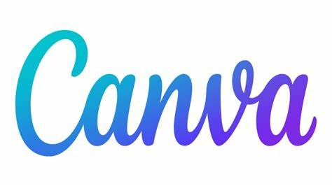

# AI Tools for Nonprofits

AI tools can save time on writing, design, research, and meeting follow-up. The best choice depends on your existing tools, budget, and comfort with sharing data.


**If you only pick one:** Use Microsoft Copilot if your team is on Microsoft 365, or Google Gemini if your team is on Google Workspace.



Do not paste donor data, HR records, legal documents, or other sensitive information into a consumer AI tool unless your organization has approved it.


### Start here

If you want a simple place to begin, these are the strongest options for most nonprofits:

* **Microsoft Copilot** if your team already uses Microsoft 365.
* **Google Gemini** if your team already uses Google Workspace.
* **Claude** if you want strong writing, summarizing, and long-document analysis.
* **ChatGPT** if you want a versatile assistant with custom GPTs and team workspaces.
* **Canva** or **Adobe Express** if you need AI help with graphics and marketing content.

### AI assistants for writing, planning, and research

#### Microsoft Copilot

<figure><figcaption></figcaption></figure>

[Microsoft Copilot](https://copilot.microsoft.com/) is a practical starting point for drafting emails, rewriting text, summarizing content, and answering everyday questions.

* **Best for:** Microsoft 365 organizations
* **Cost:** Free web version available
* **Start here:** [Open Copilot with your Microsoft 365 account](https://m365.cloud.microsoft/chat/?auth=2)

#### Google Gemini

<figure><figcaption></figcaption></figure>

[Google Gemini](https://gemini.google.com/app) works well for brainstorming, writing, research, and organizing information. It is a natural fit for teams already working in Google Workspace.

* **Best for:** Google Workspace organizations
* **Cost:** Varies by account and plan
* **Start here:** [Open Gemini](https://gemini.google.com/app)

#### Claude for Nonprofits

<figure><figcaption></figcaption></figure>

[Claude for Nonprofits](https://support.claude.com/en/articles/12893767-getting-started-with-claude-for-nonprofits) is especially strong for drafting, editing, summarizing long documents, and helping staff think through complex ideas in plain language.

* **Best for:** Writing-heavy teams and long-form analysis
* **Pricing:** Claude for organizations is paid. Eligible nonprofits can apply for discounted pricing.
* **Free option:** There is no free nonprofit organization plan. Individuals can still use Claude’s personal version.
* **Learn more:** [Get started with Claude for Nonprofits](https://support.claude.com/en/articles/12893767-getting-started-with-claude-for-nonprofits)

#### ChatGPT for Nonprofits

<figure><figcaption></figcaption></figure>

[OpenAI for Nonprofits](https://openai.com/index/introducing-openai-for-nonprofits/) gives eligible nonprofits discounted access to ChatGPT Business and ChatGPT Enterprise. It is a strong fit for drafting, brainstorming, quick editing, and building custom GPTs for repeatable workflows.

* **Best for:** General-purpose AI assistance and team workspaces with admin controls
* **Pricing:** Eligible nonprofits can apply for up to a **75% discount** on ChatGPT Business and ChatGPT Enterprise — similar to Anthropic’s nonprofit pricing for Claude
* **Free option:** ChatGPT’s free tier is available to anyone, but it lacks team admin tools and the stronger data protections of paid plans
* **Learn more:** [OpenAI for Nonprofits overview](https://openai.com/index/introducing-openai-for-nonprofits/) and [OpenAI for Nonprofits Help Center](https://help.openai.com/en/articles/9359041-openai-for-nonprofits)

#### ChatBot.com

[ChatBot.com](https://www.chatbot.com/nonprofit/) lets you build website chatbots without coding. It can answer common questions and automate simple intake tasks.

* **Best for:** After-hours donor or volunteer questions, applications, and event sign-ups
* **Nonprofit benefit:** Eligible nonprofits receive the Team Plan free. It includes up to 20 agents, five chatbots, and 5,000 chats monthly.
* **How to apply:** Complete the [nonprofit application form](https://www.chatbot.com/nonprofit/) with your registration number. Approved organizations must link to ChatBot.com or show its nonprofit badge.
* **Eligibility:** Churches, most schools, and government-affiliated organizations do not qualify.

### AI design tools for nonprofit communications

#### Canva

<figure><figcaption></figcaption></figure>

[Canva](https://www.canva.com/) remains one of the best design platforms for nonprofits. It is easy to learn and works well for social posts, flyers, presentations, event graphics, and basic brand materials.

* **Nonprofit access:** Eligible nonprofits can get Canva premium benefits
* **AI features:** Magic Write, Magic Design, and image generation tools
* **Best for:** Fast graphics and content creation for small teams
* **Related guide:** [Design & Creative Tools for Nonprofits](design-and-creative-tools-for-nonprofits.md)

#### Adobe Express for Nonprofits

<figure><figcaption></figcaption></figure>

[Adobe Express](https://www.adobe.com/express/) offers a strong free option for eligible nonprofits. It includes Adobe Express Premium and built-in Firefly generative AI features.

* **Nonprofit access:** Free Adobe Express Premium for eligible nonprofits
* **AI features:** Firefly text-to-image and design generation tools
* **Why it matters:** It is one of the strongest free options for nonprofits that want more ethically positioned AI content generation
* **Best for:** Branded marketing content, social graphics, and quick design work

### AI meeting notes and summaries

AI meeting assistants can record, transcribe, summarize, and pull out action items. They help small teams keep momentum without relying on one person’s notes.

#### Fathom

<figure><figcaption></figcaption></figure>

[Fathom](https://fathomvideo.typeform.com/nonprofits) records meetings, creates transcripts, and highlights action items and key moments.

* **Nonprofit benefit:** Nonprofits can apply for 10 free paid seats
* **Best for:** Small teams that want better notes without a large budget
* **Cost:** Free for approved nonprofit seats

#### tl;dv

[tl;dv](https://tldv.io/app/pricing/?cta=navbar-pricing) offers unlimited meeting recordings and transcripts on its free tier, plus support for many languages.

* **Nonprofit benefit:** Strong free plan for volunteer-heavy or budget-limited teams
* **Best for:** Organizations that need meeting recordings at no cost
* **Cost:** Free plan available, with paid upgrades

#### Otter.ai

<figure><figcaption></figcaption></figure>

[Otter.ai](https://otter.ai/) provides live transcription, speaker identification, summaries, and collaboration features. Nonprofits can also access a discount through TechSoup.

* **Nonprofit benefit:** 40% discount via TechSoup
* **Best for:** Teams that want polished transcripts and collaboration features
* **Cost:** Paid plans available, with nonprofit discount
* **Discount details:** [Otter x TechSoup nonprofit discount](https://help.otter.ai/hc/en-us/articles/15871360236951-Otter-x-TechSoup-Nonprofit-discount)

### Other AI tools with free plans


Free AI tools are easy to test. Review privacy settings and output quality before adopting them across your team.


#### ChatGPT (free tier)

[ChatGPT](https://chatgpt.com/) offers a free tier for individuals. For team use, see [ChatGPT for Nonprofits](#chatgpt-for-nonprofits) above for discounted Business and Enterprise plans.

#### Google NotebookLM

<figure><figcaption></figcaption></figure>

[Google NotebookLM](https://notebooklm.google/) helps you work with your own source materials. It can summarize documents, organize notes, and generate audio-style overviews.

#### Suno

<figure><figcaption></figcaption></figure>

[Suno](https://www.suno.ai/) focuses on AI-generated music and audio. It is more niche, but it can help with creative campaigns and simple audio experiments.

*Last reviewed: 2026-08.*
