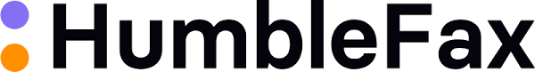

# 📠 e-Fax Solutions for Nonprofits

Fax solutions were once challenging but can now be manageable with cloud technologies. Nonprofits benefit from significant discounts, streamlined processes, secure communications, and reduced costs.&#x20;

#### HumbleFax

<figure><figcaption></figcaption></figure>

[HumbleFax ](https://humblefax.com/)offers an easy-to-use and reliable e-fax service designed to meet the needs of nonprofits. It provides secure transmission and seamless integration with existing workflows. HumbleFax offers a user-friendly interface at an incredible price of $10/mo for unlimited faxing and unlimited users.  For HIPAA-secure faxing, the price increases to $25/mo.&#x20;

#### iFax

<figure><figcaption></figcaption></figure>

iFax is a robust e-fax solution that offers advanced features and enhanced security. iFax boasts advanced security features, easy integration with cloud services, and high customization. However, it might be potentially overwhelming for more straightforward needs. [Through TechSoup, nonprofits can get a 50% discount ](https://www.techsoup.org/ifax)on iFax services, resulting $5/mo for the basic plan, and $10/mo for the Plus plan (includes HIPAA), and $15/mo for the Pro plan.&#x20;
