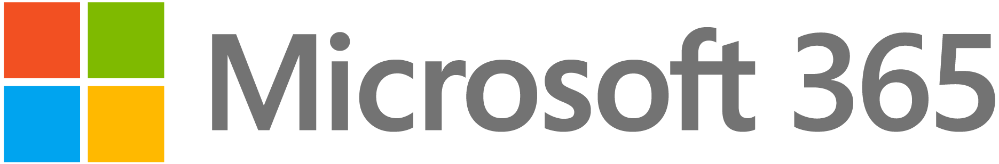
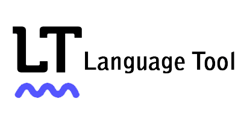

# 📄 Email & Productivity Apps for Nonprofits

These apps empower nonprofits with efficient digital tools. They facilitate seamless communication, enabling remote teamwork through email clients and collaboration platforms. Cloud storage services ensure secure file sharing, while word processing and spreadsheet applications enhance productivity. These solutions amplify nonprofit effectiveness, fostering streamlined operations, impactful outreach, and polished documentation through integrated spell-checking.


Microsoft 365 and Google Workspace are the leading productivity platforms nonprofits use worldwide. Both can be great for your nonprofit, but understanding your organization's needs and the pros & cons of each solution can help you make an informed decision on which to use.


## Microsoft 365

<figure><figcaption></figcaption></figure>

Microsoft offers eligible 501(c)(3) nonprofits a donation of **Microsoft 365 Business Basic licenses for up to 300 users** at no cost. This includes:

* Professional email with custom domain (Exchange Online, 50 GB mailbox)
* Web-only versions of Word, Excel, PowerPoint, and Outlook _(desktop apps not included)_
* 1 TB of cloud storage per user with OneDrive and SharePoint
* Microsoft Teams for meetings and chat
* Basic security and compliance features


To provision the Microsoft licenses listed below, you must be a verified nonprofit with Microsoft and be signed in with an admin account. [Refer to this article to learn how to apply for free Microsoft licensing](https://learn.goodhearttech.org/microsoft-365/microsoft-365-nonprofit-setup/how-to-apply-for-free-nonprofit-microsoft-365-services)


The following Microsoft licenses can be applied for FREE for verified 501(c)(3)s.



## Google Workspace 

<figure><figcaption></figcaption></figure>

[**Google Workspace** offers special licensing for nonprofits](https://www.google.com/nonprofits/workspace/compare/) that provides a comprehensive suite of productivity tools designed to enhance the operations of nonprofit organizations. To apply for these services, [apply here](https://www.google.com/nonprofits/) using [these instructions](../../google-workspace/google-workspace-nonprofit-setup/how-to-apply-for-free-nonprofit-google-workspace-services.md). Nonprofits can streamline communication, collaboration, and project management by leveraging features like Google Chat, Drive, Docs, Meet, and Sites.

* [Gmail ](https://mail.google.com/mail/u/0/#inbox)& [Google Calendar](https://calendar.google.com/) provide reliable email and calendaring services and seamlessly integrate with [Google Meet](https://meet.google.com/) to facilitate video conferencing and virtual meetings.
* [Google Chat](https://mail.google.com/chat) provides a centralized platform for real-time messaging and team discussions.
* [Google Drive](https://drive.google.com/drive/u/0/my-drive) offers robust cloud storage and file-sharing capabilities. It provides a space for [Google Docs](https://docs.google.com/), [Sheets](https://docs.google.com/spreadsheets/u/0/), and [Slides](https://docs.google.com/presentation/u/0/), which empower users to create, edit, and share professional-quality documents, spreadsheets, and presentations. Each nonprofit organization is granted 100 TB in total.
* [Google Sites](https://sites.google.com/) provides a user-friendly platform for creating custom websites.
* **Chrome browser / Chromebook management** via **Chrome Enterprise Core** (helpful for basic policies, security settings, and inventory)
* **Android device management** via **Android Enterprise** (helpful for basic policies, security settings, and inventory).

Find additional details about the '_Google Workspace for Nonprofits'_ plan and other discounts available to nonprofits here: [https://www.google.com/nonprofits/workspace/compare/](https://www.google.com/nonprofits/workspace/compare/)


[how-to-apply-for-free-nonprofit-google-workspace-services.md](../../google-workspace/google-workspace-nonprofit-setup/how-to-apply-for-free-nonprofit-google-workspace-services.md)


## Language Tool

<figure><figcaption></figcaption></figure>

[The free version of LanguageToo](https://languagetool.org/)l is an excellent resource for nonprofits, offering grammar, spelling, and style checks for all users, not just nonprofit organizations. Its features, like multilingual support, plagiarism detection, and writing enhancement suggestions, help users write more clearly and professionally. Nonprofits can use LanguageTool to refine their communication, whether for emails, reports, or social media content, improving outreach and engagement. [While Grammarly once offered free services to nonprofits during COVID-19, it ended the free access](https://support.grammarly.com/hc/en-us/articles/23933968316557-Grammarly-for-Nonprofits-and-NGOs-has-been-discontinued), making LanguageTool a valuable and entirely free alternative for nonprofits looking to maintain high-quality writing without the cost.

## Scheduling & Booking Services

Nonprofits can optimize appointment and scheduling tasks using the free tools below, which offer a user-friendly interface for creating scheduling pages. This solution integrates with your existing calendar to avoid conflicts. You can make a customized public page where anyone can book time with you.

| Service                                                                                 | Price                             | Sync with your Calendar | Public Booking Page  |
| --------------------------------------------------------------------------------------- | --------------------------------- | ----------------------- | -------------------- |
| [Microsoft Bookings](https://outlook.office.com/bookings/)                              | Included with Nonprofit Licensing | :white\_check\_mark:    | :white\_check\_mark: |
| [Google Calendar Appointments](https://calendar.google.com/calendar/u/0/r/appointment?) | Included with Nonprofit Licensing | :white\_check\_mark:    | :white\_check\_mark: |
| [Calendly](https://calendly.com/signup)                                                 | 1 Free User                       | :white\_check\_mark:    | :white\_check\_mark: |
| [YouCanBookMe](https://youcanbook.me/)                                                  | 1 Free User                       | :white\_check\_mark:    | :white\_check\_mark: |
| [Doodle](https://doodle.com/en/premium?currency=USD)                                    | 1 Free User                       | :white\_check\_mark:    | :white\_check\_mark: |

Calendly offers a [25% discount on **paid plans** for nonprofits and educational institutions.](https://calendly.com/solutions/education)

## Stirling Tools (PDF Editing and Management Tools)


[Click here to launch the free PDF tool.](https://pdf.goodheart.tech/)


### **What is Stirling PDF?**

Stirling PDF is a free, open-source web application that allows you to edit and manipulate PDFs easily. It's a web-based solution, meaning no software installations are required. Most importantly, [**your data is never stored on the servers**](https://github.com/Stirling-Tools/Stirling-PDF), ensuring HIPAA compliance and peace of mind. Other software like Adobe Acrobat can be expensive – Stirling PDF offers all the essential features you need, including:

* **Conversion:** Convert PDFs to various image formats (JPEG, PNG) or vice versa.
* **Merging & Splitting:** Combine multiple PDFs or extract specific pages.
* **Password Management:** Remove or add passwords to PDF files.
* **Reorganizing:** Rearrange pages within a PDF for better flow.
* **Rotation & Deletion:** Rotate pages for proper orientation or remove unwanted sections.
* **Signature, Image, & Text Insertion:** Add images or text directly into your PDFs.

### **Self-Hosting Options:**

Stirling PDF offers self-hosting options for independent use. Find out more on the Stirling PDF GitHub page: [https://github.com/Stirling-Tools](https://github.com/Stirling-Tools)

## **File Converter**

**File Converter** is a simple Windows tool that lets you quickly convert media files (documents, images, audio, video) into different formats. Once installed, you can just right-click any file in Windows Explorer and choose **Convert** to get the format you need.

Download here: [GitHub Releases](https://github.com/Tichau/FileConverter/releases/?utm_source=chatgpt.com) or [Official Site](https://file-converter.io/download.html?utm_source=chatgpt.com).
