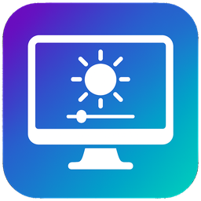
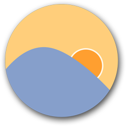

# PC Accessibility & Optimization Software for Nonprofits

Small utilities that can help staff who spend long hours at a Windows PC. These are optional add-ons, not replacements for your core email or security stack.

## Wheelhouse

<figure><figcaption></figcaption></figure>

[Wheelhouse](https://wheelhouse-project.org/) is free, open-source voice control for Windows 10 and 11. It helps when using a keyboard or mouse is painful or difficult, or when someone prefers to work by voice. Local speech recognition is free; optional cloud services may have their own costs.

## NVDA

<figure><figcaption></figcaption></figure>

[NVDA](https://www.nvaccess.org/) (NonVisual Desktop Access) is a free screen reader for Windows. Use it when built-in Narrator is not enough for a staff member who is blind or has low vision. NV Access also offers [training and support resources](https://www.nvaccess.org/about-nvda/) on their site.

## Display brightness and color

Tools that adjust how bright or warm the screen looks. Optional for staff with eye strain or long evening hours.

### Display Dimmer

<figure><figcaption></figcaption></figure>

[Display Dimmer](https://displaydimmer.com/) controls brightness and contrast on Windows 10 and 11, including external monitors. Install free from the [Microsoft Store](https://apps.microsoft.com/detail/9NBWHFCLN6CM). Eligible nonprofits can [request complimentary Pro licenses](https://displaydimmer.com/nonprofits) (reviewed by the vendor; no subscription). Good Heart Tech partners can ask us to deploy Pro on managed PCs.

### f.lux

<figure><figcaption></figcaption></figure>

[f.lux](https://justgetflux.com/) warms your screen color temperature toward evening to reduce blue light and eye strain. Free for Windows and Mac. It adjusts automatically by time of day or location. Some staff use f.lux alongside or instead of hardware brightness tools, depending on preference and monitor setup.
