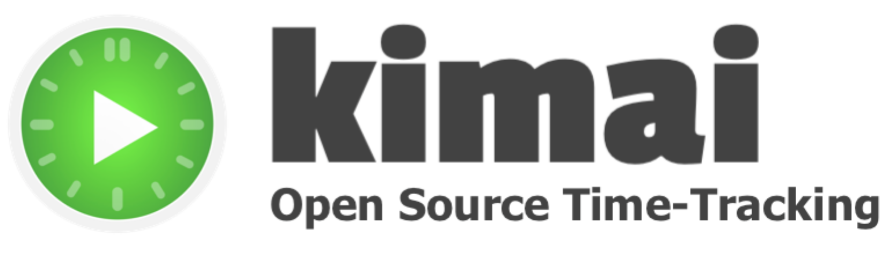

# ✔️ Task, Time, & Project Management for Nonprofits

These tools enhance collaboration, boost efficiency, and ensure that nonprofit teams can effectively manage their workflows, deadlines, and project timelines, ultimately contributing to the successful execution of their missions.

### Kimai 

<figure><figcaption></figcaption></figure>

[Kimai ](https://www.kimai.org/en/time-tracking-non-profit.html)is a robust time, expense, and project management tool that helps organizations efficiently manage their time and resources. It offers a remarkable nonprofit discount of around[$1 per user per month](https://www.kimai.org/en/time-tracking-non-profit.html), making it an affordable and effective solution for organizations with limited budgets.  Good Heart Tech highly recommends this tool and uses it heavily internally.&#x20;

### Monday.com 

<figure><figcaption></figcaption></figure>

[Monday.com](https://monday.com/product) provides a robust and integration-rich platform for project and task management and much more. Nonprofits can get the tool for [FREE for up to 10 users.](https://monday.com/nonprofits/eligibility) For over 10 users, you can get the enterprise plan for a 33% discount per user.

### Trello

[Trello offers a free tier](https://trello.com/pricing) accessible to all users, providing a versatile platform for project management. Nonprofits can create a Trello Workspace at no cost, enabling efficient collaboration and organization for their initiatives.

