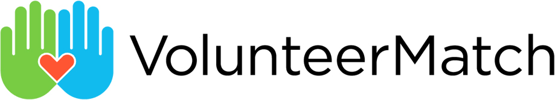

# Event & Volunteer Management Software for Nonprofits

Volunteer and event management tools are essential for nonprofits, streamlining the process of recruiting, organizing, and engaging people. Volunteer platforms help match volunteers with opportunities, track participation, and foster a sense of community. Dedicated conference tools can run the full event lifecycle—ticketing, speakers, sponsors, and budgeting—when a volunteer signup tool is not enough.


**If you only pick one:** Use [Point](https://pointapp.org/nonprofit-pricing/) for volunteer recruiting and scheduling. Use [Goots Conference](https://conference.goots.app/) if you run a ticketed conference or similar event.


| Tool | Nonprofit cost | Best for |
| --- | --- | --- |
| Point | Free for verified nonprofits | Volunteer recruiting, scheduling, and impact reporting |
| Goots Conference | Free for one conference; Standard $30/month | Ticketed conferences and similar events |
| Golden Volunteer | Free plan | Scheduling and hour tracking |
| VolunteerMatch | Free basic account | Recruiting from a national volunteer board |
| Zeffy | Free | Volunteer signup if you already use Zeffy for fundraising |

### Point 

[Point](https://pointapp.org/) is a **free** web and mobile app for volunteer management and communication. Picture it as Eventbrite meets Salesforce, but specifically for volunteers. Free features include volunteer management, recruiting, and impact reporting. Set up a Core account and start nonprofit verification at [pointapp.org/nonprofit-pricing](https://pointapp.org/nonprofit-pricing/).


[set-up-point-for-volunteer-management.md](../../tech-guides/software-guides/set-up-point-for-volunteer-management.md)


### Golden Volunteer

<figure><figcaption></figcaption></figure>

[Golden Volunteer](https://www.goldenvolunteer.com/)’s free plan includes volunteer opportunity postings, scheduling, and automated hour tracking with verification. Organizations can manage volunteer sign-ups, send basic communications, and access limited reporting on volunteer activity. The platform supports team volunteering and provides a public profile for organizations to showcase opportunities. Premium features, such as CRM integrations and advanced analytics, are available with paid plans. [Sign up for free here](https://dashboard.goldenvolunteer.com/auth/sign-up).

### Zeffy

<figure><figcaption></figcaption></figure>

Although [Zeffy ](https://www.zeffy.com/)is primarily [a fundraising platform](payment-and-financial-software-for-nonprofits.md), it also has volunteer registration and sign up features.  Learn how to setup up an event and create a volunteer sign up page, here: [Create a volunteering opportunity and receive volunteer registrations](https://support.zeffy.com/how-can-i-create-a-volunteering-opportunity-and-receive-volunteer-registrations)

### VolunteerMatch 

<figure><figcaption></figcaption></figure>

[VolunteerMatch ](https://www.volunteermatch.org/)provides a national digital infrastructure connecting volunteers and nonprofit organizations. It offers free basic accounts for nonprofits and recruiting tools for VolunteerMatch Members. By facilitating connections between passionate volunteers and nonprofits, VolunteerMatch helps organizations find highly qualified individuals who can contribute their time, money, and support.&#x20;

### Goots Conference

<figure><figcaption></figcaption></figure>

[Goots Conference](https://conference.goots.app/) is a full conference management app built by the MSP community for community events that cannot afford enterprise event platforms. It covers registration and ticketing, call for speakers, agenda, sponsor pipeline, branded event sites (or a WordPress plugin), and live budget tracking in one place. The **free** plan includes one conference with financial dashboards, revenue and cost tracking, sponsor pipeline management, and CSV import/export. Standard is **$30/month per hosted conference** and adds unlimited conferences, hosting and storage, and REST API access. Paid tickets include a 1.5% platform fee plus Stripe processing; free tickets and free events stay free. [Get started free](https://conference.goots.app/).

*Last reviewed: 2026-08.*
